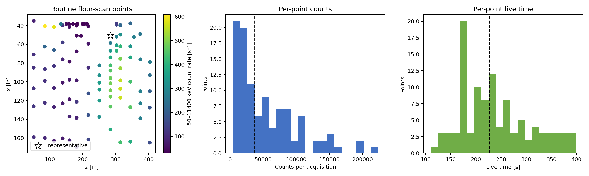
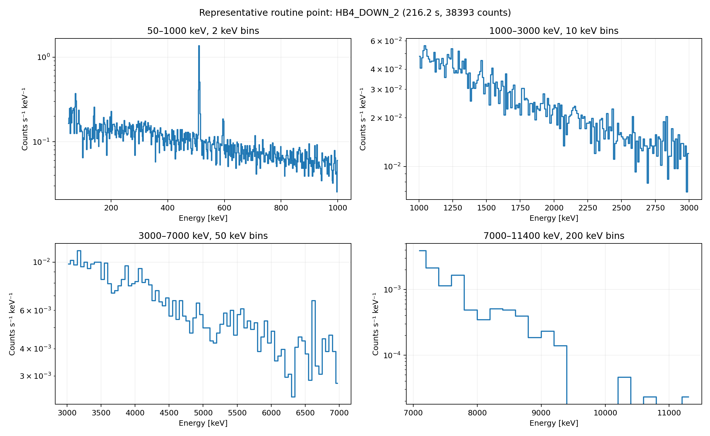
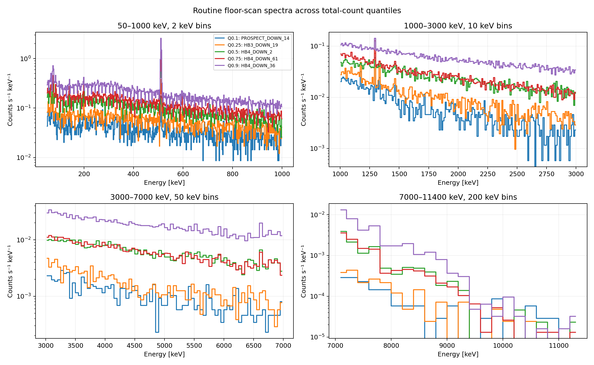

# Figure 7 floor-scan statistics

Generated with:

```bash
.venv/bin/python scripts/analyze_floor_scan_statistics.py --output-dir reports/floor_scan_statistics
```

- Original down-facing scan acquisitions: 122 at 117 coordinates.
- Routine 100–400 s acquisitions: 104 at 102 coordinates.
- Median routine live time: 227.26 s.
- Median routine 50–11400 keV counts: 37446.
- Median routine rate: 178.09 counts/s.
- Representative point: `HB4_DOWN_2` (file 1729), 216.25 s and 38393 counts.

Suggested display binning for a typical point:

| Energy range | Bin width | Median mean counts/bin | Median nonzero fraction |
|---|---:|---:|---:|
| 50–1000 keV | 2 keV | 46.0 | 1.00 |
| 1000–3000 keV | 10 keV | 55.8 | 1.00 |
| 3000–7000 keV | 50 keV | 48.3 | 1.00 |
| 7000–11400 keV | 200 keV | 16.2 | 0.77 |

These widths are presentation defaults, not a reason to discard native channel counts.
The 7–11.4 MeV region remains sparse even at 100–200 keV per bin; retain Poisson errors.
[Download all individual acquisitions with these widths](floor_scan_spectra.csv.gz).
The [point manifest](floor_scan_points.csv) and [full binning study](floor_scan_binning_summary.csv) are also available.

## Review plots






